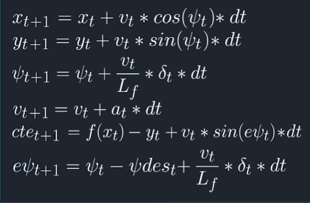

# CarND-Controls-MPC
Self-Driving Car Engineer Nanodegree Program

---

## Readme/WriteUp

### The Model
#### Polynomial Fitting and MPC Preprocessing

My model is based on the Quiz "Mind the Line" from the previous lesson.

Values of the current state of the vehicle and the 6(?) next reference points of the optimal driving line in the map are read and saved.

```cpp
vector<double> ptsx = j[1]["ptsx"];
vector<double> ptsy = j[1]["ptsy"];
double px = j[1]["x"];
double py = j[1]["y"];
double psi = j[1]["psi"];
double v = j[1]["speed"];
v*= 0.44704; //conversion to m/s
//additional values for extrapolating the position of the car including delay
double curr_steer_ang = j[1]["steering_angle"];
double curr_throttle = j[1]["throttle"];
```
In order to **account for 100ms delay time of the response** this data is used to not calculate the current state of the vehicle but the state of the vehicle in 100ms.

```cpp
double v_fut=v+curr_throttle*latency;
double psi_fut = psi - v/Lf * curr_steer_ang * latency;
double x_fut= px + v * cos(psi)*latency;
double y_fut= py + v * sin(psi)*latency;
```

Then the conversion of the reference map points from map-coordinates to car-coordinates is also done with respect to the future car position. These new reference points are used to create an interpolating polynomial.

```cpp
Eigen::VectorXd ptsx_car(ptsx.size());
Eigen::VectorXd ptsy_car(ptsy.size());

for(int i=0; i<ptsx.size(); i++){
	double x_eff=ptsx[i]-x_fut;
	double y_eff=ptsy[i]-y_fut;
	ptsx_car[i]=(x_eff*cos(psi_fut)+y_eff*sin(psi_fut));
	ptsy_car[i]=(-x_eff*sin(psi_fut)+y_eff*cos(psi_fut));
    }

//fit polynomial to line
auto coeffs = polyfit(ptsx_car, ptsy_car,3);
```

The coefficient of the polynomial are then used to calculate the approximate errors of the future state (`cte`:diversion from line, `epsi`: diversion from line direction).
With the car being at the center point of the polynomial of the mapped reference points and the car always facing forward (`psi`=0) in respect to the car, an almost empty vector of the current state is defined and loaded into the solver

```cpp
double cte_fut= polyeval(coeffs, 0);
double epsi_fut=-atan(coeffs[1]);

Eigen::VectorXd state(6);
state << 0, 0, 0, v_fut, cte_fut, epsi_fut;

//Solve for best solution
auto vars = mpc.Solve(state, coeffs);
```

#### Student describes their model in detail. This includes the state, actuators and update equations

This vehicle state, containing the position `x`,`y`, the current angle `psi`, the velocity `v`, and the positional error `cte` as well as the angular error `epsi` is loaded into the solver function. Additionally the coefficients of the polynomial of the reference points (in car coordinates) are given to that function.

Similar to the Quiz "Mind the Line" those state-values and additional actuator values (steering angle and acceleration) are loaded into a single vector (`vars`) for further processing. This vector contains also space for the state of the car and the actuators in N future time-steps.
Two other vectors are created (`vars_upperbound`,`vars_lowerbound`) containing the upper and lower bound (constraints) for each of the vehicle/actuator states in each time-step respectively. For example the steering angle is limited to +/- 0.435332 rad (+/- 25°).

##### The cost-function to be minimized
The evalutation class `fg_eval` tries to solve the equations predicting the future vehicle states while minimzing a cost-function. This is done by introducing the vector `fg`. Its first entry contains a cost that is used for penalizing driving behavior (= vehicle states, changes in vehicle states or vehicle actuations) that is detrimental for smooth and efficient driving.

For this I introduced certain error factors for each vehicle state parameter. This was done by trial and error. The driving behavior of the car was geared towards a rather conservative driving style. It often happend that after several successful laps, the car would start to build up to an oscillation around the center line on straight parts of the lap. For this and for smooth (and realistic) steering around corners I additonally introduced a penalty for high velocities at high steering angles.


```cpp
fg[0] = 0;

for (int t = 0; t < N; t++) {
	fg[0] += 1000 *CppAD::pow(vars[cte_start + t], 2);
	fg[0] += 1000 * CppAD::pow(vars[epsi_start + t], 2);
	fg[0] +=  CppAD::pow(vars[v_start + t] - ref_v, 2);
    }

    // Minimize the use of actuators.
for (int t = 0; t < N - 1; t++) {
	fg[0] +=  20* CppAD::pow(vars[delta_start + t], 2);
	fg[0] +=  5* CppAD::pow(vars[a_start + t], 2);
	//corner breaking
	fg[0] += 250 * CppAD::pow(vars[delta_start + t]*vars[v_start + t], 2);

    }

    // Minimize the value gap between sequential actuations.
for (int t = 0; t < N - 2; t++) {
	fg[0] += 500 * CppAD::pow(vars[delta_start + t + 1] - vars[delta_start + t], 2);
	fg[0] += CppAD::pow(vars[a_start + t + 1] - vars[a_start + t], 2);
    }
```
with
```cpp
//Goal velocity in m/s
double ref_v = 30;
```


##### The constraining equations predicting the future vehicle states

The rest of the entries of the `fg` vector are the differences between the states at `t+1` and the solution of the linear motion model equations using the states at `t` respectively. This is mimimized as well (recursive for each future `t`) in order to find a continuous motion of the vehicle from `t=0` to `t=N` (* dt).

Equations of the Motion model:


> These are the same equations used for predicting the car state after the latency in the `main` function.

The vector `vars` is used for recusevly storing and loading the values of the states at all times `t`.
When the the vector `fg` is mimimized, `vars` becomes the solution vector.
```cpp
for (int t = 1; t < N; t++) {
      AD<double> x0 = vars[x_start + t - 1];
      AD<double> y0 = vars[y_start + t - 1];
      AD<double> psi0 = vars[psi_start + t - 1];
      AD<double> v0 = vars[v_start + t - 1];
      AD<double> cte0 = vars[cte_start + t - 1];
      AD<double> epsi0 = vars[epsi_start + t - 1];

      AD<double> x1 = vars[x_start + t];
      AD<double> y1 = vars[y_start + t];
      AD<double> psi1 = vars[psi_start + t];
      AD<double> v1 = vars[v_start + t];
      AD<double> cte1 = vars[cte_start + t];
      AD<double> epsi1 = vars[epsi_start + t];

      // Only consider the actuation at time t.
      AD<double> delta0 = vars[delta_start + t - 1];
      AD<double> a0 = vars[a_start + t - 1];

      AD<double> f0 = coeffs[0] + coeffs[1] * x0 + coeffs[2]*CppAD::pow(x0, 2) + coeffs[3]*CppAD::pow(x0, 3); //cubic polynomial
      AD<double> psides0 = CppAD::atan(coeffs[1]+2*coeffs[2] *x0 + 3*coeffs[3]*CppAD::pow(x0, 2)); //arctan of derivate of cubic polynomial at x

      fg[1 + x_start + t] = x1 - (x0 + v0 * CppAD::cos(psi0) * dt);
      fg[1 + y_start + t] = y1 - (y0 + v0 * CppAD::sin(psi0) * dt);
      fg[1 + psi_start + t] = psi1 - (psi0-v0/Lf*delta0 * dt); //updated to opposite direction
      fg[1 + v_start + t] = v1 - (v0 + a0 * dt);
      fg[1 + cte_start + t] = cte1 - ((f0 - y0) +(v0*CppAD::sin(epsi0) * dt));
      fg[1 + epsi_start + t] = epsi1 - ((psi0 - psides0) - v0/Lf*delta0 * dt); //updated to opposite direction
    }
```


#### Timestep Length and Elapsed Duration (N & dt)

My parameters:

```cpp
// TODO: Set the timestep length and duration
size_t N = 8;
double dt = 0.1;
```

- `dt` was chosen to be 0.1 s as this is the (artificial) response delay. Anything smaller than 0.1s would make the model more complex to compute without a noticeable improvement in the solution. Bigger values would make the model more unstable especially at higher speeds
- `N` was chosen to be 8. Bigger values made the driving less stable, most likely because the car is not *directly* forced towards the optimal line but rather further "down the line". Furthermore, at higher speeds the length of the predicted line is very far in the front (future) lacking any additional information to the current state. Smaller values had problems finding a stable solution at very slow speeds (around corners, at the very beginning).

#### Results

The relevant variables of the result-vector of the optimization function are extracted to a new vector and returned to the `main` function. These are the coordinates of the projected driving line for the `N` next time step with respect to the current time step and the proposed acceleration and steering angle for the next time step.

```cpp
vector<double> shortened_solution;

for(int i=x_start; i<y_start; i++){
    shortened_solution.push_back(solution.x[i]);
    }
for(int i=y_start; i<psi_start; i++){
    shortened_solution.push_back(solution.x[i]);
    }
shortened_solution.push_back(solution.x[delta_start]);
shortened_solution.push_back(solution.x[a_start]);
shortened_solution.push_back(N); //adding length of vector to result, (easier testing later)
```
In the main function the data is extracted from the variable (here named `vars`) and used from actuating the car and displaying the proposed car trajectory.

```cpp
          size_t N = vars.end()[-1];
          steer_value=vars.end()[-3]/deg2rad(25);
          throttle_value=vars.end()[-2];

          json msgJson;
          // NOTE: Remember to divide by deg2rad(25) before you send the steering value back.
          // Otherwise the values will be in between [-deg2rad(25), deg2rad(25] instead of [-1, 1].
          msgJson["steering_angle"] = steer_value;
          msgJson["throttle"] = throttle_value;


          //Display the MPC predicted trajectory
          //.. add (x,y) points to list here, points are in reference to the vehicle's coordinate system
          // the points in the simulator are connected by a Green line
          vector<double> mpc_x_vals;
          vector<double> mpc_y_vals;

          for(int i=0; i<N;i++){
                mpc_x_vals.push_back(vars[i]);
                mpc_y_vals.push_back(vars[i+N]);
          }

          msgJson["mpc_x"] = mpc_x_vals;
          msgJson["mpc_y"] = mpc_y_vals;
```

### Performance

With the current setting the car is able to perform several laps on the track with a maximum velocity of 59mph.

Before compensating for the response delay the driving performance was much poorer. I barely reached 30mph without starting to lurch over the whole lane as the car was overcompensating for the previous driving actuations. Additionally the mapped reference points were shifted while the car was turning, leading to further inaccuracies.
